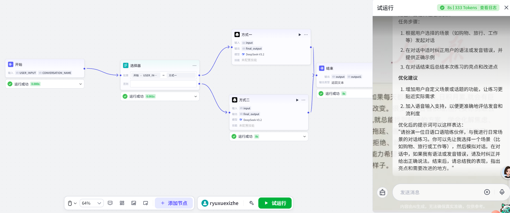

# 提示词优化工作流

这是一个 Coze 工作流，用于优化用户输入的提示词，使 AI 能生成更精确的回复。
此模型有两个方式，‘方式一用自然语言来输出自然语言 + 优化说明’‘方式二输出 IG/PE 结构化格式’。
## 使用方法

1. 登录 Coze（www.coze.cn）
2. 进入「资源库」→「工作流」→「创建工作流」
3. 打开本仓库的 `workflow.json` 文件，全选复制（Ctrl+A → Ctrl+C）
4. 回到 Coze 新建的工作流，粘贴（Ctrl+V）
5. **手动连接开始节点和结束节点**
6. 检查开始节点的输入参数是否正确
7. 点击「试运行」测试
## 效果预览

## 注意事项

- 需要手动连接开始节点和结束节点
- 需要检查开始节点的输入参数
- 如果节点配置了 API Key，记得替换成自己的