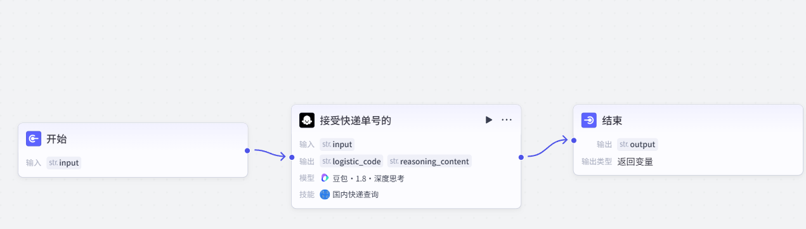
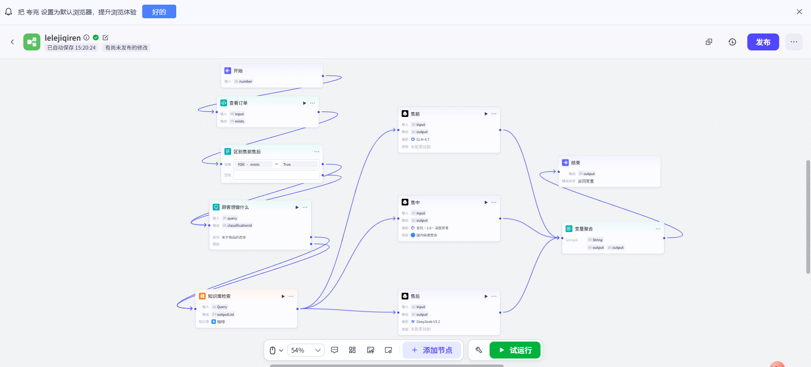

# 客服机器人 - Coze + Python 版 🤖

一个基于 Coze 工作流和 Python 的智能客服机器人。支持快递查询，通过 API 调用 Coze 工作流后自动返回物流信息。
👏
## 功能 📦

- 接收用户输入（快递单号等）
- 调用 Coze 工作流进行识别
- 返回快递物流信息
## Agent架构原理
- 感知层（耳朵 & 眼睛）:接收用户咨询语句，捕获用户输入
- 认知层（大脑思考）：理解用户诉求 + 区分售前 / 售中 / 售后场景
- 决策层（拿主意）：判定业务场景，选择对应专属模型与回复策略
- 执行层（动手干活）：调用对应模型接口，生成针对性业务回复
- 输出整理好的客服话术，回复用户
  
## 其他功能 😂

- 能像平台基础的机器人一样回答问题
- 分售前、售中、售后服务
- 可自行去添加详细的问题分类

## 注意事项⚠️
- 前面要先获取平台的API，让py文件和API结合，才能获取顾客的订单信息
- 转接人工客服时也需获取每个客服的API，来分流
- 使用平台之前先用没有开流的账号先运行一次
- coze的功能是要顾客输入快递单号去查询，可能会遇到顾客不知道单号的情况，可自行去添加获取平台单号的信息之后再来链接coze插件，建议让内部人员操作这项

- 也可以简单一点：**转人工**让客服直接回答

- coze工作流比较简单，感兴趣的可以在里面多添加其他的插件（如下图，只作演示）


- 例如：闲聊这一块，查询商品有关专业知识这一块，对于商品出现的专业词语这一块。

## 优化记录 📝

### 2026-07-05
**优化内容**：
1. 添加了 `langchain客服.py` 文件，使用 LangChain 增强意图识别功能
2. 集成 Ollama 本地模型（qwen2.5:0.5b）进行 AI 意图识别
3. 添加对话记忆功能（保存最近10轮对话）
4. 为所有代码添加详细中文注释，方便学习

**修改文件**：
- `langchain客服.py` - 新增文件，LangChain 意图识别模块

**新增依赖**：
- langchain
- langchain-community
- langchain-openai
- ollama（本地安装）

**功能说明**：
- 使用 AI 识别用户意图（售前、售中、售后、转人工）
- 替代原有的关键词匹配方式，识别更准确
- 支持上下文理解，记住用户之前说过的话

## 快速开始🚀

### 1. 克隆项目

```bash
git clone https://github.com/你的用户名/仓库名.git
cd 仓库名
 

bash
pip install cozepy python-dotenv

安装依赖
bash

pip install cozepy python-dotenv
配置环境变量
复制 .env 文件（已包含在项目中），填入你自己的 Coze 信息：
bash

COZE_API_TOKEN=你的PersonalAccessToken
WORKFLOW_ID=你的工作流ID

如何获取？
COZE_API_TOKEN：登录 Coze → 头像 → 设置 → API 密钥 → 创建新密钥
WORKFLOW_ID：进入你的工作流 → 浏览器地址栏 workflow_id=xxx 后面的数字
