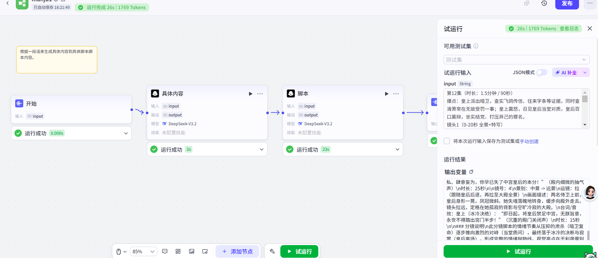

> 一个“人机协作”式的脚本生成工作流

## 核心逻辑

人工输入需求 → Coze 工作流生成脚本 → 人工审核、修改 → 最终定稿

## 设计原因

本工作流**不包含图片生成功能**，原因如下：

1. **积分成本高**： 图片生成消耗较大
2. **质量需要人工把关**：宁可慢一点，也要保证能过自己这关

## 适用场景
- 视频脚本
- 文案草稿
- 任何“必须先过自己眼睛”的内容。
## 使用方法

1. 登录 Coze（www.coze.cn）
2. 进入「资源库」→「工作流」→「创建工作流」
3. 打开本仓库的 `coze‘脚本工作流’.json` 文件，全选复制（Ctrl+A → Ctrl+C）
4. 回到 Coze 新建的工作流，粘贴（Ctrl+V）
5. **手动连接开始节点和结束节点**
6. 检查开始节点的输入参数是否正确
7. 点击「试运行」测试
## 效果预览

## 注意事项
- 本工作流不生成图片